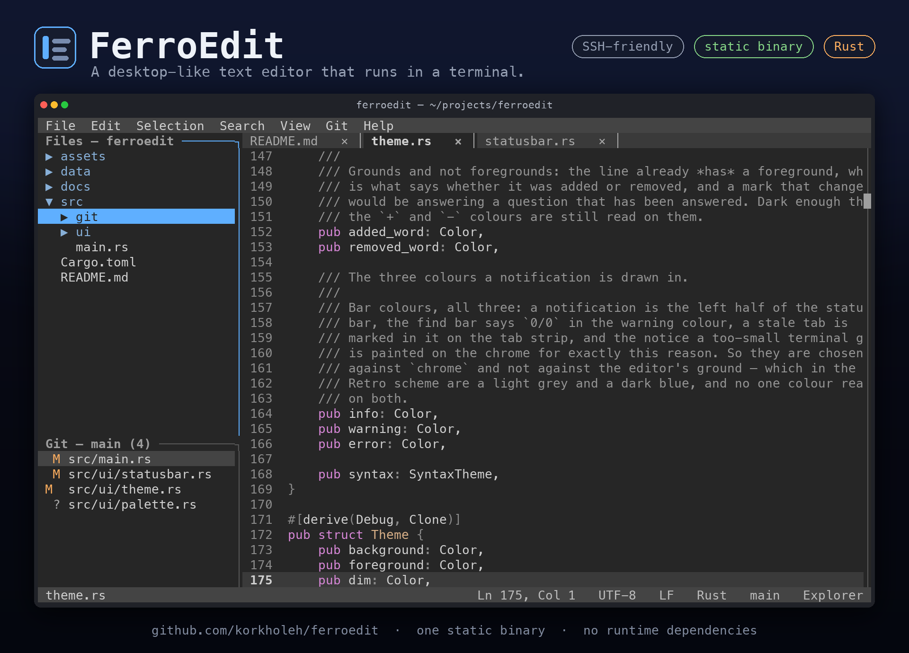

<p align="center">
  
</p>

<h1 align="center">FerroEdit</h1>

<p align="center">
  <em>A modern desktop-like text editor that happens to run in a terminal.</em>
</p>

<p align="center">
  
  
  
  
</p>

FerroEdit is a non-modal, mouse-friendly terminal editor for people who do not want to
learn Vim. Menus, tabs, a file explorer, syntax highlighting and Git — in one static
binary, over SSH, with no runtime dependencies.

## Installation

Download a build from [the latest release](https://github.com/korkholeh/ferroedit/releases/latest).
Each one is a single binary with no runtime dependencies; the Linux builds are statically
linked against musl, so they run on any distribution.

```bash
tar -xzf ferroedit-x86_64-unknown-linux-musl.tar.gz
./ferroedit .
```

Every archive ships a `.sha256` beside it:

```bash
sha256sum -c ferroedit-x86_64-unknown-linux-musl.tar.gz.sha256
```

Targets: `x86_64-unknown-linux-musl`, `aarch64-unknown-linux-musl`,
`aarch64-apple-darwin`, `x86_64-apple-darwin`. Windows is not part of the MVP.

### From source

```bash
git clone https://github.com/korkholeh/ferroedit
cd ferroedit
cargo build --release
```

The binary lands in `target/release/ferroedit`. For the static Linux builds:

```bash
cross build --release --target x86_64-unknown-linux-musl
cross build --release --target aarch64-unknown-linux-musl
```

## Usage

```bash
ferroedit              # open the current directory
ferroedit .            # same
ferroedit src/main.rs  # open a file
ferroedit a.rs b.rs    # open two files, one tab each
ferroedit +42 main.rs  # open a file at line 42
```

## Requirements

- A terminal with mouse support (iTerm2, Ghostty, Terminal.app, kitty, tmux, …).
- The system `git` binary (2.23 or newer, for `git switch`), for the Git panel.
  FerroEdit ships no Git implementation
  of its own — your existing credentials, SSH config and commit signing keep working.

## Features (MVP scope)

- Non-modal editing with the shortcuts you already know
- Mouse: click, drag-select, scroll, menus, tabs, explorer
- Tabs, a `.gitignore`-aware file explorer, and file operations
- Syntax highlighting
- Search and replace, and Go to Line
- Word wrap, or horizontal scrolling when it is off
- Git: status, stage/unstage, commit, pull, push, branches, merge, diff
- One static binary, SSH-friendly

## Keyboard shortcuts

`F1` (or Help → Shortcuts) shows them in the editor. The same tables render
[docs/SHORTCUTS.md](docs/SHORTCUTS.md), so neither can drift from the code. Regenerate it with `ferroedit --dump-shortcuts >
docs/SHORTCUTS.md`, or `FERROEDIT_UPDATE_DOCS=1 cargo test`; a plain `cargo test` fails
when the checked-in copy is stale (ADR-028).

## Development

```bash
cargo fmt --all
cargo clippy --all-targets --all-features -- -D warnings
cargo test --all-features
```

### Cutting a release

`scripts/release.sh` bumps the version in `Cargo.toml`, refreshes `Cargo.lock`, runs the
three commands above and then commits and tags. It pushes nothing: everything it does is
undoable with `git reset` and `git tag -d`, and the push is the first step that is not.

```bash
scripts/release.sh patch --dry-run   # 0.1.0 -> 0.1.1, and stop
scripts/release.sh minor             # bump, gate, commit, tag
git push origin main v0.2.0          # this is what publishes
```

Pushing the tag starts [`release.yml`](.github/workflows/release.yml), which drafts a
GitHub Release, builds the four targets, attaches a tarball and a checksum for each, and
publishes only once all four are in.

Docs: [ARCHITECTURE](docs/ARCHITECTURE.md) · [PLAN](docs/PLAN.md) ·
[ROADMAP](docs/ROADMAP.md) · [PROGRESS](docs/PROGRESS.md) ·
[DECISIONS](docs/DECISIONS.md)

## License

MIT
