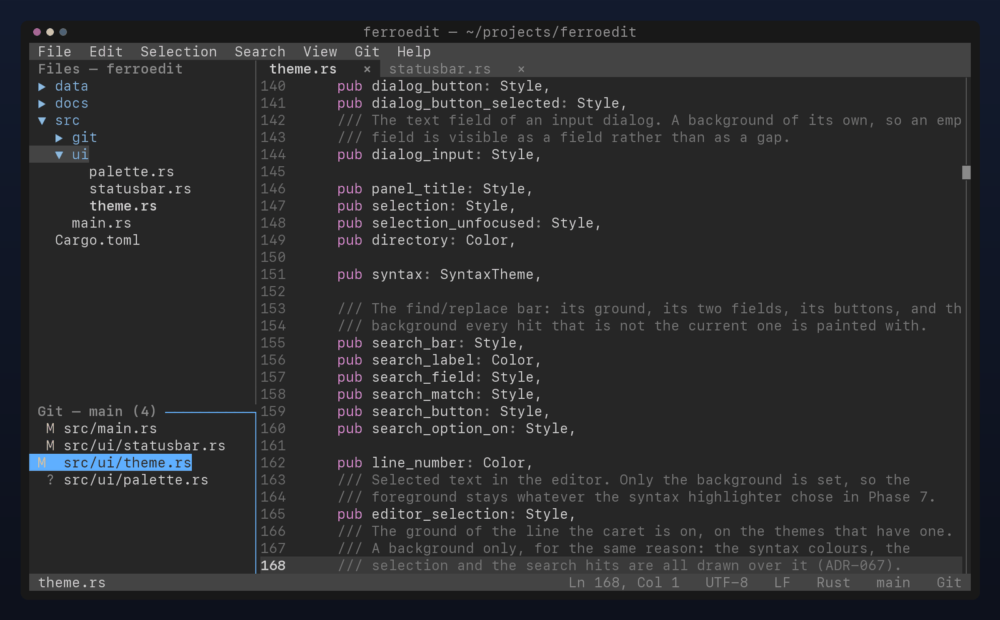
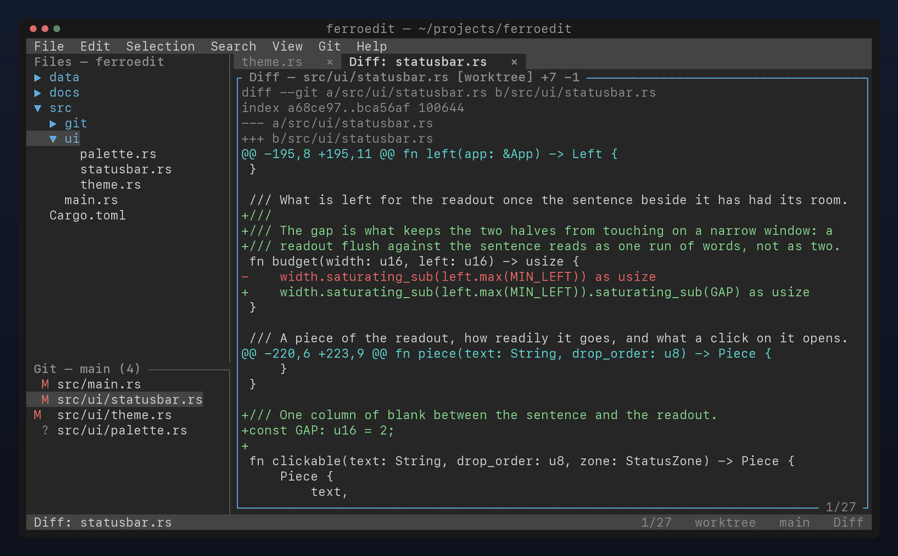
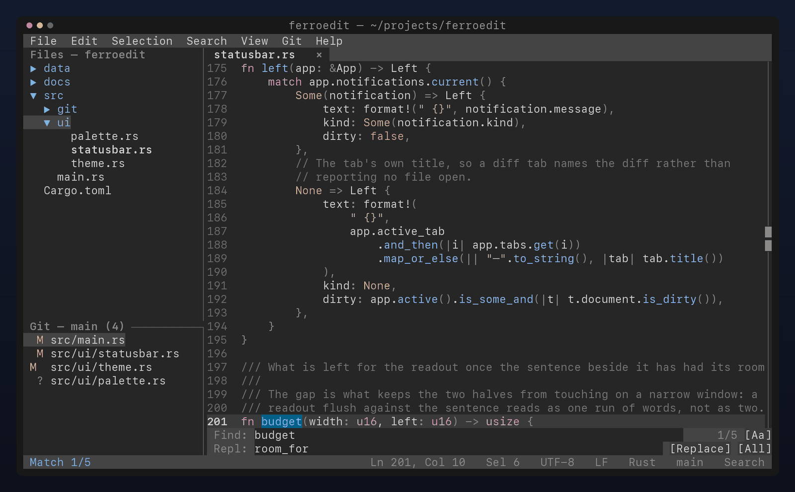
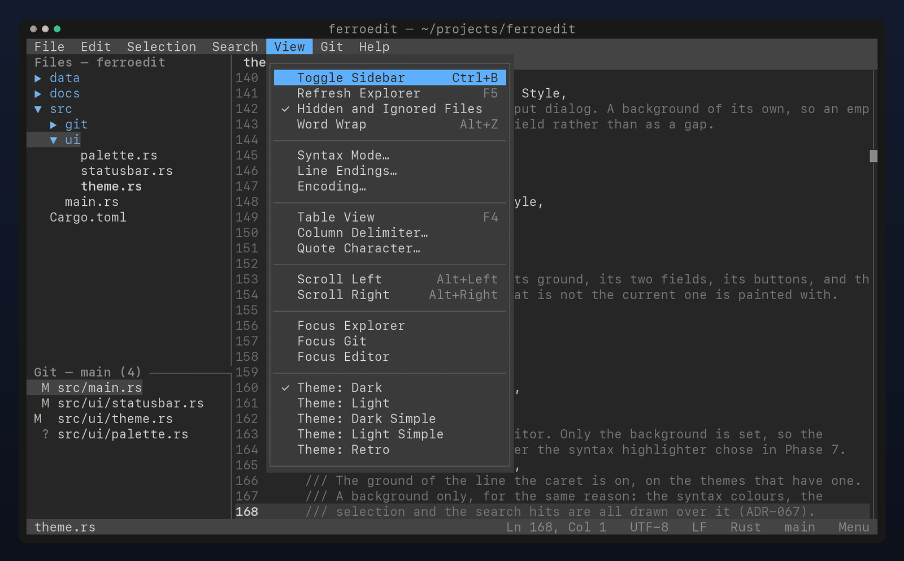
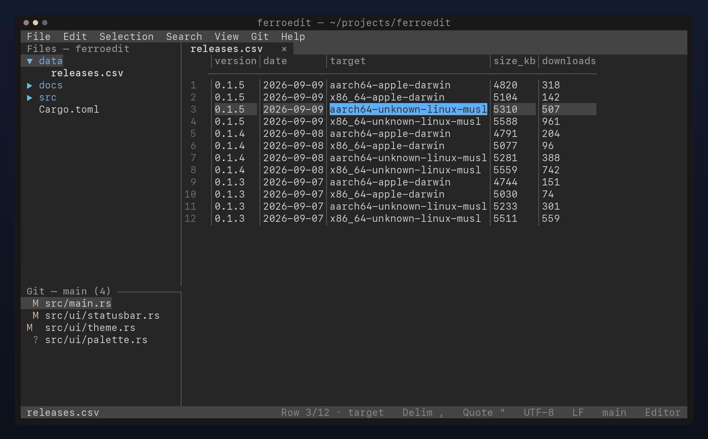
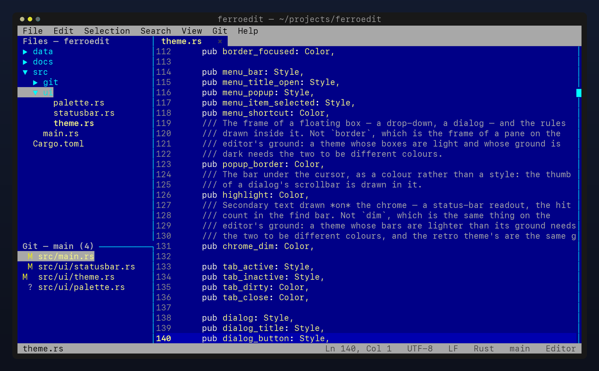

<p align="center">
  
</p>

<h1 align="center">FerroEdit</h1>

<p align="center">
  <em>A modern desktop-like text editor that happens to run in a terminal.</em>
</p>

<p align="center">
  
  
  
  
</p>

FerroEdit is a non-modal, mouse-friendly terminal editor for people who do not want to
learn Vim. Menus, tabs, a file explorer, syntax highlighting and Git — in one static
binary, over SSH, with no runtime dependencies.

## Installation

```bash
curl -fsSL https://raw.githubusercontent.com/korkholeh/ferroedit/main/scripts/install.sh | sh
```

That is macOS and Linux, Intel and ARM. The script picks the build for your machine,
checks it against the `.sha256` published beside it, and puts a single binary in
`~/.local/bin` — no package manager, no `sudo`, nothing else touched. Read it first if
you would rather:
[scripts/install.sh](scripts/install.sh).

Arguments go after `-s --`:

```bash
curl -fsSL .../install.sh | sh -s -- --version v0.1.1   # a specific release
curl -fsSL .../install.sh | sh -s -- --dir ~/bin        # somewhere else
curl -fsSL .../install.sh | sh -s -- --help
```

`FERROEDIT_VERSION` and `FERROEDIT_INSTALL_DIR` do the same as the first two. A directory
that needs root is not one the script will `sudo` its way into — create it yourself and
make it writable, or install to your home and move the binary.

Upgrading is the same line again: the new binary is renamed into place, so it works with
the editor open. Uninstalling is `rm ~/.local/bin/ferroedit`.

FerroEdit tells you when there is one to run: at start-up, at most once a day, it asks
GitHub whether there is a newer release and says so on the status bar. *Help ▸ Check for
Updates* asks now; *Help ▸ Check on Start* turns the automatic check off, and that choice
lives in `~/.config/ferroedit/config.json` as `check-for-updates`. The request is made by
the `curl` or `wget` already on the machine — the binary carries no HTTP client — and the
editor never installs anything itself.

### Manually

Download a build from [the latest release](https://github.com/korkholeh/ferroedit/releases/latest).
Each one is a single binary with no runtime dependencies; the Linux builds are statically
linked against musl, so they run on any distribution.

```bash
tar -xzf ferroedit-x86_64-unknown-linux-musl.tar.gz
./ferroedit .
```

Every archive ships a `.sha256` beside it:

```bash
sha256sum -c ferroedit-x86_64-unknown-linux-musl.tar.gz.sha256
```

Targets: `x86_64-unknown-linux-musl`, `aarch64-unknown-linux-musl`,
`aarch64-apple-darwin`, `x86_64-apple-darwin`. Windows is not part of the MVP.

### From source

```bash
git clone https://github.com/korkholeh/ferroedit
cd ferroedit
cargo build --release
```

The binary lands in `target/release/ferroedit`. For the static Linux builds:

```bash
cross build --release --target x86_64-unknown-linux-musl
cross build --release --target aarch64-unknown-linux-musl
```

## Usage

```bash
ferroedit              # open the current directory
ferroedit .            # same
ferroedit src/main.rs  # open a file
ferroedit a.rs b.rs    # open two files, one tab each
ferroedit +42 main.rs  # open a file at line 42
```

## Requirements

- A terminal with mouse support (iTerm2, Ghostty, Terminal.app, kitty, tmux, …).
- `curl` or `wget`, for the release check. Without either, the check says so and nothing
  else changes.
- The system `git` binary (2.23 or newer, for `git switch`), for the Git panel.
  FerroEdit ships no Git implementation
  of its own — your existing credentials, SSH config and commit signing keep working.

## Features (MVP scope)

- Non-modal editing with the shortcuts you already know
- Mouse: click, drag-select, scroll, menus, tabs, explorer
- Tabs, a file explorer that shows everything on disk (dotfiles and git-ignored
  files included, hideable from the View menu), and file operations
- Syntax highlighting
- Search and replace, and Go to Line
- Word wrap, or horizontal scrolling when it is off
- Git: status, stage/unstage, commit, pull, push, branches, merge, diff
- A release check that can be switched off, and never installs anything itself
- One static binary, SSH-friendly

## Screenshots

Every image is a capture of the running binary, not a mock-up: `ferroedit` runs in a pty
at 110×32, the ANSI it writes is parsed cell by cell, and the grid is drawn back out with
the colours it actually painted.

<table>
  <tr>
    <td width="50%"></td>
    <td width="50%"></td>
  </tr>
  <tr>
    <td><b>Git, in the sidebar.</b> Status with a mark per file — staged, modified,
    untracked — and stage, commit, pull, push, branch and merge on single keys.</td>
    <td><b>The diff.</b> Read-only, in a tab beside the files being edited, over the
    system <code>git</code> rather than a reimplementation of it.</td>
  </tr>
  <tr>
    <td></td>
    <td></td>
  </tr>
  <tr>
    <td><b>Find and replace.</b> A two-row bar under the document, the hit count on the
    right, and every other match on the page highlighted behind it.</td>
    <td><b>Menus that say what they do.</b> The keys are printed beside the commands, the
    switches carry their state, and the mouse reaches all of it.</td>
  </tr>
  <tr>
    <td></td>
    <td></td>
  </tr>
  <tr>
    <td><b>CSV as a table.</b> <code>F4</code> switches a delimited file between text and
    a grid you can walk cell by cell, with the delimiter and quote on the status bar.</td>
    <td><b>Five themes.</b> Dark, light, two simple ones for terminals with a palette of
    their own, and the retro blue above.</td>
  </tr>
</table>

## Keyboard shortcuts

`F1` (or Help → Shortcuts) shows them in the editor. The same tables render
[docs/SHORTCUTS.md](docs/SHORTCUTS.md), so neither can drift from the code. Regenerate it with `ferroedit --dump-shortcuts >
docs/SHORTCUTS.md`, or `FERROEDIT_UPDATE_DOCS=1 cargo test`; a plain `cargo test` fails
when the checked-in copy is stale (ADR-028).

## Development

```bash
cargo fmt --all
cargo clippy --all-targets --all-features -- -D warnings
cargo test --all-features
```

### Cutting a release

Before the bump, close the **Unreleased** section of [CHANGELOG.md](CHANGELOG.md): retitle
it as the version being cut with the date, add the compare link at the foot, and open a
fresh empty **Unreleased** above it. The changelog is what a user reads to decide whether
to upgrade, so a version that ships without its entry ships blind.

`scripts/release.sh` bumps the version in `Cargo.toml`, refreshes `Cargo.lock`, runs the
three commands above and then commits and tags. It pushes nothing: everything it does is
undoable with `git reset` and `git tag -d`, and the push is the first step that is not.

```bash
scripts/release.sh patch --dry-run   # 0.1.0 -> 0.1.1, and stop
scripts/release.sh minor             # bump, gate, commit, tag
git push origin main v0.2.0          # this is what publishes
```

Pushing the tag starts [`release.yml`](.github/workflows/release.yml), which drafts a
GitHub Release, builds the four targets, attaches a tarball and a checksum for each, and
publishes only once all four are in.

Docs: [CHANGELOG](CHANGELOG.md) · [ARCHITECTURE](docs/ARCHITECTURE.md) · [PLAN](docs/PLAN.md) ·
[ROADMAP](docs/ROADMAP.md) · [PROGRESS](docs/PROGRESS.md) ·
[DECISIONS](docs/DECISIONS.md)

## License

MIT
